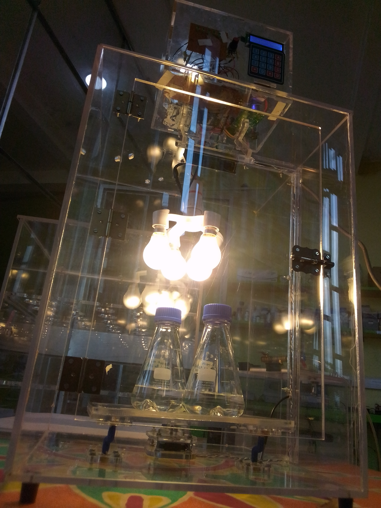

# Shaker-Incubator

MboaLab in Cameroon were awarded a $750 grant by the Build Free and Open Science Hardware Project led by Andre Chagas and supported by the Mozilla Foundation to build a low-cost, open-source incubator for microbiology. This shaker incubator was built in collaboration with [Beneficial Bio](https://beneficial.bio/) following future plans from Incubator project, to incorporate orbital shaking to increase aeration of cultures and therefore the yield of micro-organisms and their products like proteins.  

**Why a Shaker-incubator?**
Most biology labs in Cameroon and elsewhere in resource-constrained contexts are under-equipped due to the high cost of lab equipment and it is essential for many protocols including open enzyme manufacturing to provide optimal conditions for cell growth, where some type of agitation or shaking is necessary to incorporate oxygen and evenly distribute nutrients throughout the culture media. That's often done by placing a separate shaker inside an incubator, but incubator shakers combine those functions for a more convenient and efficient setup. The incubator shaker can be used for growth of just about any kind of cell including bacterial cultures, tissue cultures, and yeast. 

**Why open hardware?**
We believe that DIY and Open Science Hardware can facilitate access to low-cost and high-quality equipment for biology labs in Cameroon, Ghana and beyond. 

All resources are openly licensed and linked below.

# Build you own incubator

 - If you would like to build the device, get started by following the [build documentation](https://github.com/Mboalab/Shaker-Incubator/blob/main/Documentation/Building/Building.md)
 - The folders in this repository contain details of the [materials needed](https://github.com/Mboalab/Shaker-Incubator/blob/main/Hardware/BOM/BOM.md), laser cut design [files](https://github.com/Mboalab/Shaker-Incubator/tree/main/Hardware/Laser_Cut_Files), the Arduino-based [electronics design](https://github.com/Mboalab/Shaker-Incubator/tree/main/Hardware/Electronics) and firmware.
 - If you have questions or suggestions for improvements, please [add an issue](https://github.com/Mboalab/Shaker-Incubator/issues) or make a pull request.

# Related Links

# Acknowledgements

-   OPGES: Ariel Kameni
-   Image credits for Incubator: MboaLab Team

# Licensing

This hardware is licensed under [INSERT LICENSE HERE]

